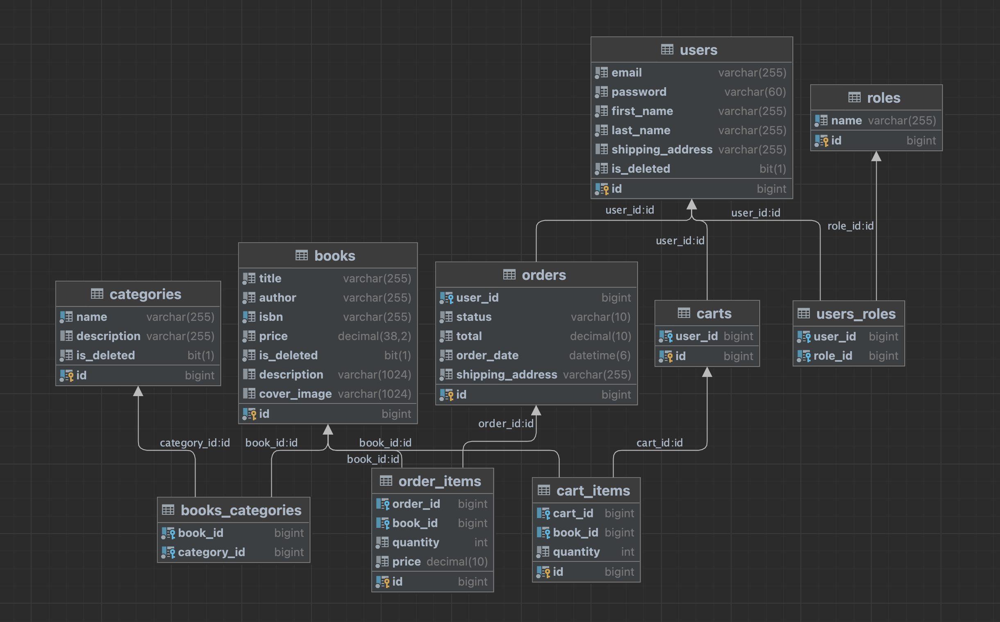

<h1 align="center">Book Store App</h1>

---
This handy and secure app allows users to make purchases online, and it has all the functionality you would need to successfully manage your book store. Admins can add new books to DB, all books have categories, so it is easy to filter and find them by category. Books that the user plans to buy are added to a shopping cart. Before accessing the app, as it has RESTful architecture the user should be authorized with login and password, and later on it's gonna work with JWT till it's expired. All users are divided into admins and users, providing them with certain rights in the app.

* Do you want to **keep track** of the stock of books that there is in your shop?
* Do you want to use **handy** tool for that purpose?
* Are you **tired** of numerous pages of confusing documentation?
* Do you want to provide your customers with **enjoyable** way of making purchases in your bookshop?

###  If you have ever faced any of the above problems, you are in the right place to solve them once and forever. 🎯

## Description of the project

---
## Project Technologies
- **Programming Language:** `Java 17`
- **Spring Framework:** `Spring Boot v3.1.5, Spring Data, Spring Security v6.1.5 (Authentication using JWT token)`
- **Database Management:** `MySQL 8.0.33, Hibernate, Liquibase v4.20.0`
- **Testing:** `JUnit 5, Mockito, TestContainers v1.18.0`
- **Deployment and Cloud Services:** `Docker 3.8`
- **Additional instruments:** `Maven, Lombok, Mapstruct`
- **Documentation:** `Swagger`

## How to use the application?

---
1. Make sure you have JDK and Docker installed
2. Clone the repository from GitHub
3. Create .env file and fill in all necessary variables
4. Run the command mvn clean package
5. Run docker-compose up --build to build and start the Docker containers
6. The application should be running at http://localhost:8081
7. Swagger is available for testing at http://localhost:8081/swagger-ui/index.html#/

## Database structure

## Controllers and endpoint available ⬇
All unauthenticated users can register and login. After users can see all books as well as info on only
a certain book, they can see all categories and all books present in one category.
Users can put a book into a shopping cart, change chosen quantity, delete it from shopping cart or see all
books that they added there before. Also, they can place an order, see their order history, items from a
specific order.
Admins can modify DB: add a new book, update info on it or delete. They can do the same with categories.
Admins can also change status of a certain order.

## Endpoints
___

### Authentication Controller  :

| Method | Endpoint          | Description             | Roles  |
|--------|-------------------|-------------------------|--------|
| POST   | api/auth/register | register a new user     | Anyone |
| POST   | api/auth/login    | login a registered user | Anyone |

### Category Management

| Method | Endpoint                  | Description                            | Roles |
|--------|---------------------------|----------------------------------------|-------|
| POST   | api/categories            | Creates a new category                 | ADMIN |
| GET    | api/categories            | Returns a list of all categories       | USER  |
| GET    | api/categories/{id}       | Returns category with id (if exists)   | USER  |
| PUT    | api/categories/{id}       | Updates a category with id (if exists) | ADMIN |
| DELETE | api/categories/{id}       | Deletes a category with id (if exists) | ADMIN |
| GET    | api/categories/{id}/books | Returns all books by category          | USER  |

### Book Management

| Method | Endpoint         | Description                                             | Roles |
|--------|------------------|---------------------------------------------------------|-------|
| GET    | api/books        | Get a list of all available books on page with size = 5 | USER  |
| GET    | api/books/{id}   | Get book by id if present                               | USER  |
| POST   | api/books        | Creates a new book                                      | ADMIN |
| PUT    | api/books/{id}   | Updates book with id (if exists)                        | ADMIN |
| GET    | api/books/search | Searches book with parameters                           | USER  |
| DELETE | api/books/{id}   | Deletes a book with id (if exists)                      | ADMIN |

### Cart Management

| Method | Endpoint            | Description                            | Roles |
|--------|---------------------|----------------------------------------|-------|
| GET    | api/cart            | Returns user's shopping cart           | USER  |
| POST   | api/cart            | Adds cart item to user's shopping cart | USER  |
| PUT    | api/cart-items/{id} | Updates cart item with id (if exists)  | USER  |
| DELETE | api/cart-items/{id} | Deletes cart item                      | USER  |

### Order Management

| Method | Endpoint                           | Description                                         | Roles |
|--------|------------------------------------|-----------------------------------------------------|-------|
| POST   | api/orders                         | Creates an order withing Shopping cart is not Empty | USER  |
| GET    | api/orders                         | Gets user's order                                   | USER  |
| PATCH  | api/orders/{id}                    | Updates order status                                | ADMIN |
| GET    | api/orders/{orderId}/items         | Get all items from order                            | USER  |
| GET    | api/orders{orderId}/items/{itemId} | Gets order item by id and order id                  | USER  |